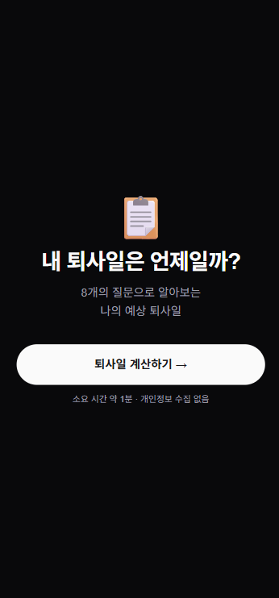
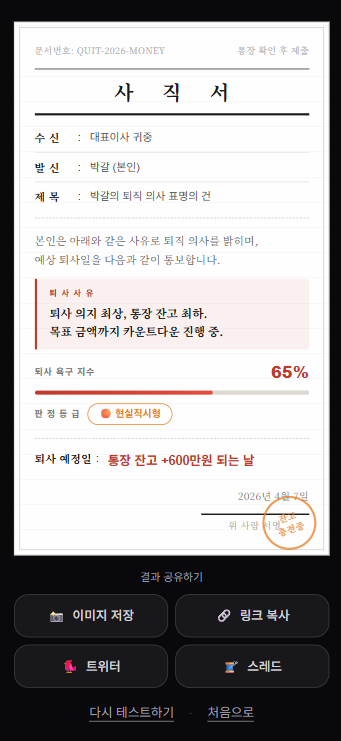

# nagaja (나가자) 🚪

> 당신의 예상 퇴사일을 계산해드립니다

---

## 서비스 소개

직장인이라면 누구나 한 번쯤 생각해본 그 질문.

**"나 언제 퇴사하지?"**

8개의 공감 질문에 답하면 나만의 사직서가 완성됩니다.
예상 퇴사일, 퇴사 욕구 %, 그리고 10가지 퇴사 유형 중 나의 유형까지.

👉 **[사이트 바로가기](https://nagaja.site)**

---

## 서비스 미리 보기

| 랜딩                                    | 질문                                 | 결과                                   |
| --------------------------------------- | ------------------------------------ | -------------------------------------- |
|  |  |  |

## 주요 기능

- 8개 질문으로 퇴사 욕구 측정
- 10가지 퇴사 유형 분류
- 사직서 형태의 결과 카드 생성
- 이미지 저장 / 카카오 / 트위터 / 스레드 / 링크 공유

---

## 퇴사 유형 10가지

| 유형                | 설명                                       |
| ------------------- | ------------------------------------------ |
| 🟢 모범사원형       | 아직 회사에 미련이 있는 사람               |
| 🌴 제주도카페사장형 | 바탕화면에 창업계획\_진짜최종.xlsx 보유 중 |
| 📋 만년이직준비형   | 이직 준비 중인 척만 3년째                  |
| 🕵️ 조용한퇴사형     | 몸만 출근, 마음은 이미 없음                |
| 🎲 무계획퇴사형     | 계획은 없고 욱은 있음                      |
| 📁 사직서7개보유형  | 사직서\_최종진짜.hwp 보유 중               |
| 💸 통장이붙잡는형   | 월세, 카드값, 구독료가 공범                |
| 🔥 번아웃말기형     | 뇌 활동 최소한으로 유지 중                 |
| ✈️ 이미탈출한형     | 이번엔 진짜 퇴사함 (6번째)                 |
| 💀 전설의퇴사형     | 팀장님 저 잠깐요...                        |

---

## 기술 스택

```
Next.js 14 (App Router)
TypeScript
Tailwind CSS
html2canvas
카카오 SDK
Vercel
```

---

## 로컬 실행

```bash
git clone https://github.com/junseoparkk/nagaja
cd nagaja
npm install
npm run dev
```

---

## 프로젝트 구조

```
nagaja/
├── app/
│   ├── page.tsx                  # 랜딩
│   ├── quiz/page.tsx             # 질문
│   ├── loading/page.tsx          # 로딩
│   └── result/
│       ├── page.tsx              # 결과
│       └── opengraph-image.tsx   # OG 이미지
├── components/
│   ├── NameInput.tsx
│   ├── QuizCard.tsx
│   ├── ResignationCard.tsx
│   └── ShareButtons.tsx
├── data/
│   ├── questions.ts
│   ├── results.ts
│   └── utils.ts
├── types/
│   └── index.ts
└── docs/
    └── PRD.md
```

---

## 유저 플로우

```
랜딩 → 이름 입력 → 질문 8개 → 로딩 → 사직서 결과 → SNS 공유
```

---

## 개인정보 처리

- 이름은 브라우저 내에서만 사용
- 서버 저장 없음
- 개인정보 수집 없음

---

## 마치며

이 서비스는 퇴사를 부추기려고 만든 게 아닙니다.

매일 아침 알람을 끄면서도 출근하고,
월급날만 기다리면서도 버티고,
속으로 사직서를 열두 번 썼다가 지우는
대한민국의 모든 직장인들에게 바칩니다.

퇴사하든, 버티든, 이직하든.
어떤 선택을 해도 당신은 잘 하고 있습니다.

**오늘도 수고했어요. 🚪**

---

> 이 서비스는 풍자입니다. 실제 퇴사 전 통장 잔고를 확인하세요.  
> © 2026 [@junseoparkk](https://github.com/junseoparkk) · 1년 50서비스 프로젝트 1/50
